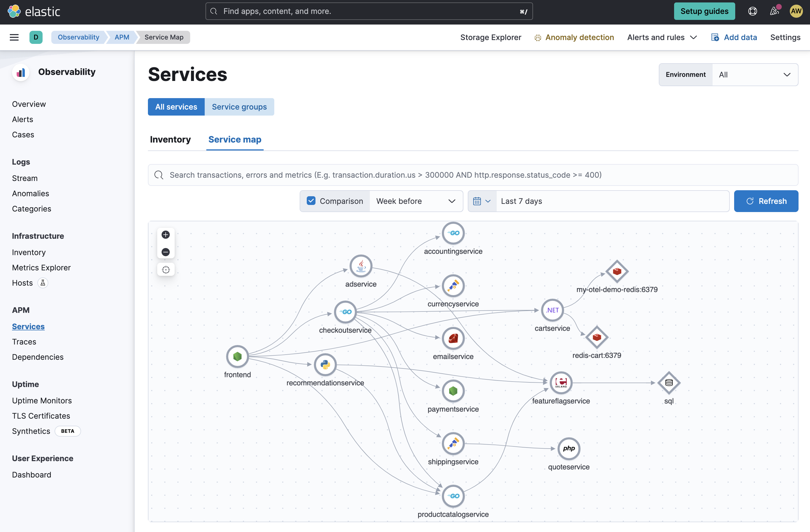
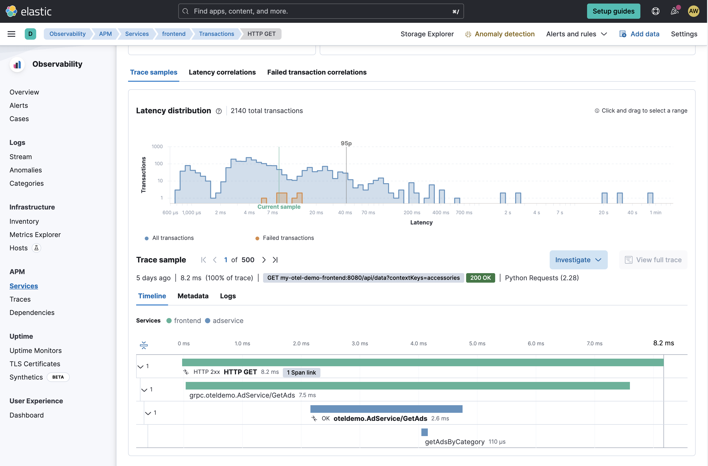
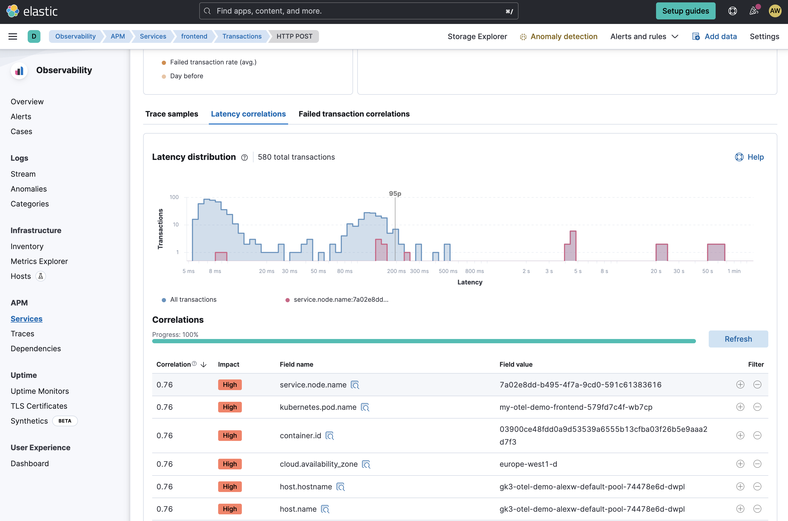
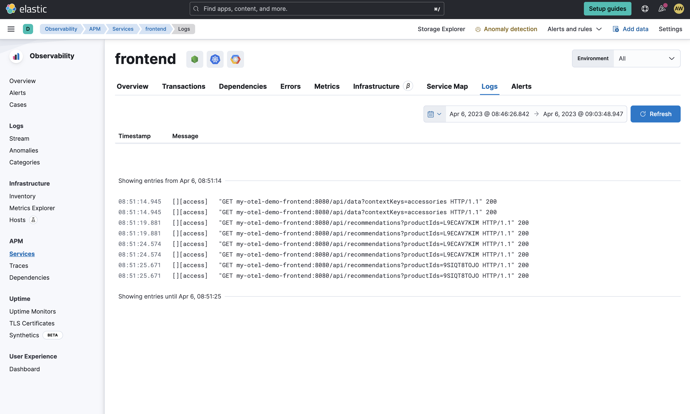

<!-- markdownlint-disable-next-line -->
#  :heavy_plus_sign:  OpenTelemetry Demo with Elastic Observability

The following guide describes how to setup the OpenTelemetry demo with Elastic Observability using [Docker compose](#docker-compose) or [Kubernetes](#kubernetes).

## Devoteam Elastic Cloud setup tldr;

This demo writes Opentelemetry data to multiple outputs:
* Jaeger
* Prometheus
* Elasticsearch APM
* Opensearch Observability

The configuration has already been setup to write to the DevoTeam Elastic Cloud deployment. See `src/otelcollector/otelcol-config.yml`.
The docker-compose file has been updated to include a 2-node Opensearch cluster.

How to run locally using docker-compose:
```
### Opensearch/Elasticsearch requires a change to some memory config

sudo sysctl -w vm.max_map_count=262144
docker compose pull
docker compose up -d
```

Once everything is running, the following endpoints should be available:
* Webstore: http://localhost:8080/
* Grafana: http://localhost:8080/grafana/
* Feature Flags UI: http://localhost:8080/feature/
* Load Generator UI: http://localhost:8080/loadgen/
* Jaeger UI: http://localhost:8080/jaeger/ui/
* Opensearch Dashboard: http://localhost:5601 (username/pw: admin)
* Elasticsearch Kibana: https://devoteam-observability.kb.westeurope.azure.elastic-cloud.com:9243

## Docker compose

1. Start a free trial on [Elastic Cloud](https://cloud.elastic.co/) and copy the `endpoint` and `secretToken` from the Elastic APM setup instructions in your Kibana.
1. Open the file `src/otelcollector/otelcol-config-extras.yml` in an editor and replace the following two placeholders:
   - `YOUR_APM_ENDPOINT_WITHOUT_HTTPS_PREFIX`: your Elastic APM endpoint (*without* `https://` prefix)
   - `YOUR_APM_SECRET_TOKEN`: your Elastic APM secret token.
1. Start the demo with the following command from the repository's root directory:
   ```
   docker-compose up -d
   ```

## Kubernetes
### Prerequisites:
- Create a Kubernetes cluster. There are no speccific requirements, so you can create a local one, or use a managed Kubernetes cluster, such as [GKE](https://cloud.google.com/kubernetes-engine), [EKS](https://aws.amazon.com/eks/), or [AKS](https://azure.microsoft.com/en-us/products/kubernetes-service).
- Set up [kubectl](https://kubernetes.io/docs/reference/kubectl/).
- Set up [Helm](https://helm.sh/).

### Start the Demo
1. Setup Elastic Observability on Elastic Cloud.
1. Create a secret in Kubernetes with the following command.
   ```
   kubectl create secret generic elastic-secret \
     --from-literal=elastic_apm_endpoint='YOUR_APM_ENDPOINT_WITHOUT_HTTPS_PREFIX' \
     --from-literal=elastic_apm_secret_token='YOUR_APM_SECRET_TOKEN'
   ```
   Don't forget to replace
   - `YOUR_APM_ENDPOINT_WITHOUT_HTTPS_PREFIX`: your Elastic APM endpoint (*without* `https://` prefix)
   - `YOUR_APM_SECRET_TOKEN`: your Elastic APM secret token
1. Execute the following commands to deploy the OpenTelemetry demo to your Kubernetes cluster:
   ```
   # switch to the kubernetes/elastic-helm directory
   cd kubernetes/elastic-helm

   # add the open-telemetry Helm repostiroy
   helm repo add open-telemetry https://open-telemetry.github.io/opentelemetry-helm-charts

   # deploy the demo through helm install
   helm install -f values.yaml my-otel-demo open-telemetry/opentelemetry-demo
   ```

## Explore and analyze the data With Elastic

### Service map


### Traces


### Correlation


### Logs
